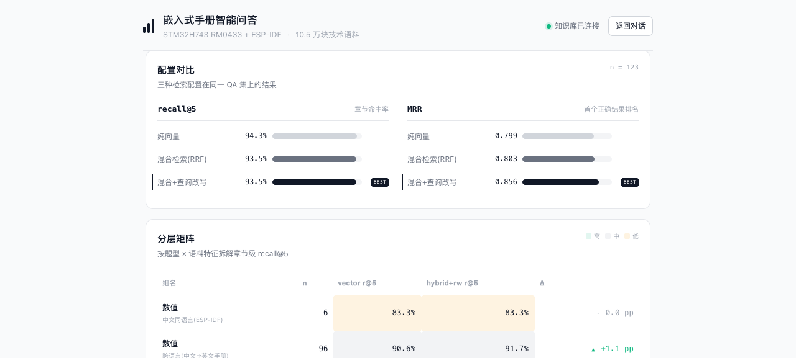

<div align="center">

# manual-qa

**可评测的 Agentic RAG · 嵌入式技术手册智能问答**

对 STM32H743 参考手册（RM0433, 3353 页）与 ESP-IDF 编程指南（2855 页，中文）
建立的问答系统：混合检索 → 查询改写 → LLM 重排 → 引用溯源，
每一个数字来自可复现实验。

[](https://github.com/www312/manual-qa/actions/workflows/ci.yml)
[]()
[]()

**[Live Demo](http://43.142.30.173)** · 对话（四种模式）→ 引用溯源 → 点右上角「评测」看量化看板

</div>

---

## 为什么这个项目不一样

大多数 RAG demo 止步于"能问答"。这个项目的核心是**评测驱动**：
123 题分层 QA 集 + 块级/章节级双口径指标，每次检索优化都有 before/after 数据，
并且全部展示在产品内的[评测看板](#评测看板)上——不是写在 README 里的静态数字，是可点击验证的。

```
┌────────────────────────────────────────────────────────────┐
│                     数据流水线（离线）                        │
│  PDF → 书签层级感知分块 → 表格转Markdown → tiktoken精确切片    │
│         217,321 块全量 → 按章节价值精选 105,716 块入库         │
└──────────────────────────┬─────────────────────────────────┘
                           ▼
┌────────────────────────────────────────────────────────────┐
│                     在线检索链（每次提问）                     │
│                                                            │
│  追问 ──→ Contextualizer 代词消解（多轮）                     │
│    │                                                       │
│    ├──→ 向量检索（原查询 · 语义）──┐                          │
│    │                              ├─→ RRF 融合(k=60)         │
│    └──→ BM25（LLM改写查询 · 词法）─┘                         │
│                           ▼                                │
│              LLM listwise 重排（近邻干扰消解）                 │
│                           ▼                                │
│           glm-4.7 生成 · 内联引用[n] · SSE 流式               │
│           （资料不足时软着陆：给最相关内容+指路，不编造）          │
└────────────────────────────────────────────────────────────┘
```

另有 **Agent 模式**：LLM 通过 function calling 自主决定何时查手册、查什么、
查几次（问"有几个 USART"触发 4 次渐进查询；问天气零次调用直接拒答），
工具调用全过程在前端逐步可视化。

## 评测看板



Live Demo 右上角「评测」入口。KPI 四卡、三配置对比（BEST 徽章）、
题型×语料热力矩阵（Δ 三角标注），全部数据带口径说明。

## 核心实验结果

**总体（123 题，章节级 recall@5）**

| 配置 | recall@5 | MRR | 块级精确命中 |
|---|---|---|---|
| 纯向量 | 94.3% | 0.799 | 9.8% |
| 混合检索（RRF） | 93.5% | 0.803 | 7.3% |
| **混合 + 查询改写** | **93.5%** | **0.856** | **13.0% (+33%)** |

**分层发现（题型 × 语料，章节级 recall@5）**

| 分组 | n | vector | hybrid+改写 | Δ |
|---|---|---|---|---|
| 数值 · 跨语言（中文→英文手册） | 96 | 90.6% | 91.7% | +1.1pp |
| 条件 · 跨语言 | 10 | 90.0% | **100%** | **+10.0pp** |
| 条件 · 中文同语言 | 8 | 87.5% | **100%** | **+12.5pp** |
| 步骤 · 跨语言 | 2 | 50.0% | **100%** | +50.0pp |

> 描述性问题（条件/步骤型）是查询改写的主场——语义扩展把中文问句映射到英文检索词，
> 跨语言 lexical gap 被显著收窄。

**一个真实的优化闭环（近邻干扰案例）**

公网实测发现：用户问 `APB1ENR`（旧名），召回被 `APB1LLPENR`（低功耗变体，
只差一个"L"）抢占前排，导致拒答。诊断 → 召回层字面相似度无法区分语义修饰 →
上线 LLM listwise 重排（粗排 k×2 召回，精排取前 k）→ 同一问题从拒答变为
正确回答 `RCC_APB1LENR 偏移 0x0E8 [1]`。全过程见提交历史。

## 技术栈

| 层 | 选型 | 为什么 |
|---|---|---|
| 解析 | PyMuPDF（书签层级 + find_tables） | 官方书签是比字号猜测可靠一个量级的语义边界；寄存器位定义全在表格里 |
| 分块 | tiktoken cl100k 精确计数 + 512/64 滑窗 | 粗估 token 曾导致超限（智谱 embedding 输入上限无文档，实测定位） |
| 向量 | 智谱 embedding-3（2048 维，实测） | 官方文档写 2560 是错的 |
| 检索 | Qdrant + BM25(jieba保形分词) + RRF | 融合只看排名不看分数，免疫两侧量纲差异 |
| 生成 | glm-4.7（OpenAI 兼容协议） | 换供应商只改 .env 三行 |
| 服务 | FastAPI + SSE + nginx（关缓冲） | SSE 反代必须 `proxy_buffering off`，CRLF 帧解析有两层坑 |
| 前端 | Vue3 + TS（零图表库，纯 CSS 看板） | 文档流设计语言（参考 Vercel AI Playground） |
| 工具 | MCP `manual_search`（stdio，全协议验证） | 只暴露检索不暴露生成——工具应是能力原语 |
| 部署 | Docker Compose（app/qdrant/nginx）+ ufw + fail2ban + IP 限流 | 公开 demo 必须防刷 key |

## 快速开始

```bash
# 1. 后端
uv sync && cp .env.example .env   # 填入智谱 API key
uv run python -m manual_qa.index  # 入库（首次约 50 分钟，embedding API）
uv run uvicorn manual_qa.server:app --port 8000

# 2. 前端
cd frontend && npm install && npm run dev

# 3. 无后端快速体验（mock 数据）
cd frontend && npm run mock & npm run dev
```

**评测复现**：`uv run python -m manual_qa.evaluate`（基线）·
`scripts/eval_p2.py`（四配置对照）· `scripts/eval_breakdown.py`（分层矩阵）

## 项目结构

```
src/manual_qa/
  ingest.py         # PDF 解析：书签骨架/表格→MD/TOC清洗/精确分块
  index.py          # Qdrant 入库（local 与 server 模式一键切换）
  retrieval.py      # 向量/BM25/RRF + 保形分词器 + 芯片前缀切分
  rewrite.py        # LLM 查询改写（中文问句 → 英文检索词，缓存）
  contextualize.py  # 多轮对话：代词消解 → 独立问题
  rerank.py         # LLM listwise 重排（粗排→精排两段式）
  generation.py     # RAG 生成：三级拒答策略 + 引用溯源 + SSE
  agent.py          # ReAct 循环（function calling，自主调用检索工具）
  mcp_server.py     # MCP 工具：manual_search（stdio）
  evaluate.py       # recall@k / MRR 双口径评测器
  ratelimit.py      # 每 IP 每日限流（公开 demo 防刷）
  server.py         # FastAPI：/api/ask(SSE) /api/search /api/metrics
frontend/           # Vue3：四模式对话 + Agent 步骤可视化 + 评测看板
scripts/            # 部署/评测/迁移/诊断脚本
```

## 踩坑记录（面试可讲的都在这）

| 坑 | 定位过程 | 解法 |
|---|---|---|
| 智谱 embedding 输入上限（错误码 1210，无文档） | 二分定位 6212 字符阈值，发现是 TOC 点线行 token 失真 | tiktoken 精确计数 + 目录行清洗 |
| 中文虚词在英文语料被 IDF 反向加权 | "的/是/多少"把 HSEM 题顶到蓝牙章节 | 中文停用词两侧过滤，BM25 9.8%→24.4% |
| SSE CRLF 双重坑 | mock 用 \n 真服务用 \r\n，mock 验收通过但真后端全挂 | 帧分隔正则 + 帧内清 \r；教训：协议细节 mock≠真实现 |
| Qdrant local(sqlite) ≠ server 格式 | 直接拷目录报 collection 不存在 | 写 export/import 脚本零成本迁移 10.6 万点（省 25 元重嵌入费） |
| 连写输入 STM32GPIO | 保形分词成整词，语料 0 命中 | 芯片前缀切分 + 单测回归（测试抓出循环内漏改的一处） |
| git 历史泄 key | 推送前全历史扫描发现 | git-filter-repo 替换 + 验证 0 泄漏后才开源 |

## 评测口径说明（诚实声明）

- **章节级 recall@5**：top-5 命中正确内容所在章节。种子块严格口径（9.8%）会低估系统——
  正确答案常在种子邻近块，抽查 30 个 miss 案例发现 26 个实际命中同章节后引入此口径
- QA 集由 LLM 依种子块出题（题必然可由语料回答），人工抽检
- Agent/rerank 等含 LLM 调用的环节未纳入 123 题全量评测（成本原因），以案例实测呈现

## 相关链接

- [评测方法论与项目时间线](docs/) · [API 契约](docs/api-contract.md)
- 面试拷问清单与完整决策记录见项目维护者的知识库

---

<div align="center">

**从 PDF 到可验证的公网服务，全部代码与数据可复现。**

</div>
